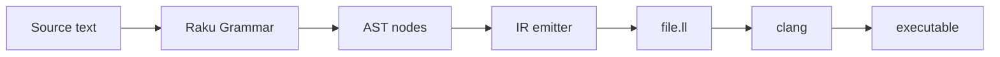

# Rakurust — design and roadmap

This document is the **project plan**: goals, architecture, language subset, and how we intend to grow. It was originally drafted for implementation and is kept in-repo as the source of truth for direction.

**Status:** The first milestones (skeleton, grammar v0, LLVM text emitter, CLI, feature catalog, integration tests) are implemented. The **expansion order** and **non-goals** below still guide future work.

## Primary goal — Raku as the exhibit

The compiler is the **vehicle**, not the hero. Implementation choices should **prefer idiomatic Raku** where it clarifies the design, and should **introduce a breadth of language features over time** rather than minimizing Raku to “just enough scripting.”

**Secondary goal:** a correct, minimal pipeline (parse → AST → `.ll` → `clang` → run) with a slowly growing Rust-shaped subset.

**Non-goal:** contorting the codebase to use every Raku feature once; avoid gimmicks (for example junctions where a simple `if` is clearer). Prefer **one clear, teachable use** per feature.

## Living catalog

See **[raku-features-used.md](raku-features-used.md)** — a table of Raku features used in this codebase, with links to rendered docs and to the **vendor copy** of [Raku/doc](https://github.com/Raku/doc) under `vendor/raku-doc/`.

**Conventions for that file:**

- Add or extend a row **in the same commit** as the code that introduces or meaningfully uses the feature.
- **Where** should be grep-friendly: subroutine name, grammar rule name, or type name, not fragile line numbers unless automated.
- Optional **“Planned / not yet used”** subsection for showcase ideas (e.g. `proto token` variants, `hyper` for batch tests).

## Context

- **Codegen:** emit **LLVM assembly (`.ll`) as text**; no LLVM C API binding in early versions.
- **Verification:** `clang file.ll -o out && ./out` (requires `clang` on `PATH`). Exit code reflects the returned `i32` (modulo platform conventions).

## Architecture



- **Parser:** Raku `grammar` + action class — declarative parsing, `make`, and later proto rules / token factoring as expressions grow.
- **AST:** `role` for shared node behavior + `class` per node; optional `enum` for operators (record in the catalog).
- **IR emitter:** `multi` methods on the emitter, temp names for SSA, `gather` / `take` (or similar) for IR lines; `given` / `when` or maps for opcode selection — document the choice in **raku-features-used.md**.
- **CLI:** `subset` / `where`, `Str()` coercions, `multi MAIN` for modes.
- **Tests:** Raku `Test`; optional later: junctions or `hyper` only if they simplify assertions naturally.

## Language subset — v0 (current baseline)

**Syntax (Rust-flavored, not full Rust):**

```text
fn main() -> i32 {
    return <expr>;
}
```

**`<expr>` in v0:**

- Decimal integer literals → `i32`
- Parentheses
- Binary operators: `+`, `-`, `*`, `/` (signed integer division, truncating toward zero)

**Explicit non-goals for v0:** `let`, other functions, types other than `i32`, `bool`, control flow, strings, attributes, `pub`, semicolon inference, `println!`, macros, modules.

**LLVM shape:** `define i32 @main() { entry: ... ret i32 ... }` using `i32` ops (`add`, `sub`, `mul`, `sdiv`).

## Layout (as implemented)

| Piece | Responsibility |
|-------|----------------|
| [lib/Rakurust/Grammar.rakumod](../lib/Rakurust/Grammar.rakumod) | `grammar Rakurust::Grammar` + actions |
| [lib/Rakurust/AST.rakumod](../lib/Rakurust/AST.rakumod) | AST types |
| [lib/Rakurust/EmitLLVM.rakumod](../lib/Rakurust/EmitLLVM.rakumod) | AST → `.ll` text |
| [bin/rakurust.raku](../bin/rakurust.raku) | CLI: read source, emit IR |
| [META6.json](../META6.json) | Module metadata / `provides` |

## Testing

- Integration tests in `t/`: compile fixture → write `.ll` → `clang` → run binary, assert **exit code**.
- From repo root: `prove -v -e raku t/*.t` (requires `clang` and a writable Rakudo precomp cache, typically under `$HOME`).

## Expansion order (slow roadmap)

Add **one** of these per step (not all at once):

1. **`let x = expr;` + `return expr;`** with sequential statements (still one function); emitter uses alloca + `load`/`store` or phis later.
2. **`fn other(...) -> i32`** and calls; LLVM `define` + `call`.
3. **Unary `-` and/or `bool` + `if` / `else`** (branching; phi or alloca).
4. **`while` or `loop`** with multiple blocks and backward branches.

Each step is a chance to add **one more Raku feature** to **raku-features-used.md** (e.g. grammar proto branch, new `multi`, `subset` for symbols).

## Approaches considered

1. **Textual LLVM IR only (current)** — Fast to ship; debuggable; only `clang` required. You must keep SSA rules consistent by hand.
2. **Shell out to `rustc` / MIR** — Out of scope for “compiler in Raku.”
3. **LLVM FFI from Raku** — Possible later; higher setup cost; defer until IR emission is stable.

## Risks / notes

- **SSA:** Single-block `main` keeps v0 trivial; `if` / `while` need allocas + loads/stores or proper phi nodes.
- **Rust compatibility:** This is a **Rust-shaped** toy language, not a front-end for real Rust crates.

## Prerequisites

- [Rakudo](https://rakudo.org/) (Raku).
- **`clang`** that accepts the emitted IR; extend the module header in the emitter if you need a pinned triple/datalayout for portability.
